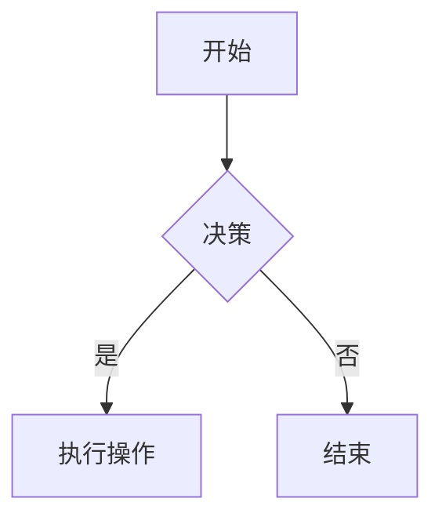
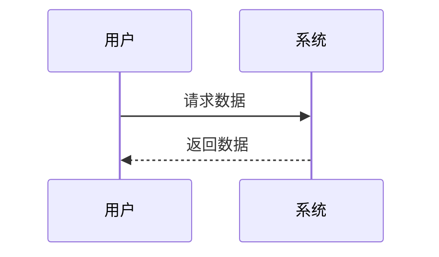
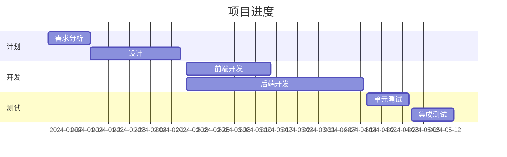

# Markdown 语法功能测试

[TOC]

---

​ 本文档旨在展示各种 Markdown 语法功能，包括基本格式化、列表、链接、图片、代码块、表格、数学公式、Mermaid 图表等。这份综合测试将帮助您验证不同 Markdown 渲染器对这些功能的支持。

## 1. 标题

# 一级标题

## 二级标题

### 三级标题

#### 四级标题

##### 五级标题

###### 六级标题

---

## 2. 文本格式

**加粗文本**

_斜体文本_

**_加粗并斜体文本_**

~~删除线文本~~

<u>下划线文本</u> <!-- 注意：某些渲染器可能不支持下划线 -->

---

## 3. 列表

### 无序列表

- 第一项
- 第二项
  - 第二项的子项 1
  - 第二项的子项 2
- 第三项

### 有序列表

1. 第一项
2. 第二项
   1. 第二项的子项 1
   2. 第二项的子项 2
3. 第三项

### 任务列表

- [x] 完成任务一
- [ ] 完成任务二
- [ ] 完成任务三

---

## 4. 链接和图片

### 链接

这是一个 [示例链接](https://www.example.com)。

### 图片


> 注意：某些渲染器可能需要特定权限以显示外部图片。

---

## 5. 代码

### 行内代码

这里是一个示例代码 `print("Hello, World!")`。

### 代码块

```python
def greet():
    print("Hello, World!")

greet()
```

```javascript
function greet() {
  console.log("Hello, World!");
}

greet();
```

---

## 6. 块引用

> 这是一个块引用。
>
> 它可以跨越多行。

---

## 7. 表格

| 姓名  | 年龄 |
| ----- | ---- |
| Alice | 25   |
| Bob   | 30   |
| Carol | 22   |

| 产品 | 价格 | 库存 |
| ---- | ---- | ---- |
| 苹果 | \$1   | 100  |
| 香蕉 | \$0.5 | 200  |
| 葡萄 | \$2   | 150  |

---

## 8. 数学公式

### 行内公式

爱因斯坦的质能方程为 $E = mc^2$。

### 块公式

$$
\int_{a}^{b} f(x) \,dx = F(b) - F(a)
$$

$$
\nabla \cdot \mathbf{E} = \frac{\rho}{\varepsilon_0}
$$

> 注意：数学公式的渲染取决于渲染器是否支持 LaTeX。

---

## 9. Mermaid 图表

### 流程图



### 时序图



### 甘特图



> 注意：Mermaid 图表需要渲染器支持 Mermaid 语法。

---

## 10. 分隔线

---

---

---

---

## 11. 其他

### 文本对齐

某些渲染器支持文本对齐：

左对齐（默认）

<center>居中对齐</center> <!-- 非标准 Markdown -->

<div align="right">右对齐</div> <!-- 使用 HTML -->

### 脚注

这是一个脚注示例。[^1]

[^1]: 这是脚注内容。

### 高亮

这是 ==高亮== 文本。

### 表情

这是一个笑脸表情 😊。

### 简码

- \:smile:
- \:heart:
- \:rocket:

---

## 12. 不支持的语法示例

### 行内 HTML

<p style="color:red;">这是红色文本。</p>

### 自定义容器

::: warning
这是一个警告框。
:::

### 嵌套任务列表

- [x] 主任务
  - [x] 子任务一
  - [ ] 子任务二

### LaTeX 宏

\newcommand{\vect}[1]{\boldsymbol{#1}}
