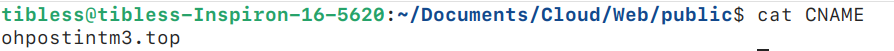

# 我的个人网站与博客（旧版网站，已弃用）

## 1. 这是如何运作的？

​	我的网站是使用 [gatsby-themes](https://github.com/LekoArts/gatsby-themes) 生成的静态网站，并部署在 GitHub Pages 上，而我的博客是手写的，同样部署在 GitHub Pages 上。如果您不熟悉如何使用 GitHub Pages，可以参考这篇 [快速入门文章](https://docs.github.com/en/pages/quickstart)。


## 2. 部署步骤

### 2.1. 网站

#### 2.1.1. 安装

- 克隆项目，删除 `.git` 并添加自己的 Git 仓库： 

```bash
git clone https://github.com/LekoArts/gatsby-starter-portfolio-cara.git
cd gatsby-starter-portfolio-cara
rm -rf .git
git init 
git remote add origin 'your github page'
```

- 安装依赖：

```bash
npm install
npm install gh-pages --save-dev
```

- 在 `package.json` 中添加脚本：

```json
"scripts": {
    "develop": "gatsby develop",
    "deploy": "gatsby build --prefix-paths && gh-pages -d public",
    "build": "gatsby build --prefix-paths"
}
```

并修改 `gatsby-config.ts`，以下是一个可修改的模板：

```json
siteMetadata: {
  siteTitle: `您的站点标题`,
  siteTitleAlt: `您的站点副标题`,
  siteHeadline: `对您的站点的简短描述`,
  siteUrl: `https://您的域名.com`,
  siteDescription: `适合SEO的站点描述`,
  siteImage: `/您的图片.jpg`, 
  siteLanguage: `zh`, 
  author: `您的名字或昵称`,
}
```

- 构建并部署。
- 将分支设置为 `gh-pages`，作为部署分支。如果不清楚如何操作，可以咨询 GPT。
- 在 `public` 文件夹下创建 CNAME 文件，内容为您的域名。
- 重新构建并部署。
- 然后您可以在自己的域名上看到模板网站。

#### 2.1.2. 项目结构与命令

​	网站是通过 gatsby-themes 生成的，整个过程很简单：编辑 `.mdx` 文件并运行几条命令即可。网站主要分为四个部分：介绍、项目、关于和联系。要编辑这些部分的内容，只需修改位于 `$project/src/@lekoarts/gatsby-theme-cara/sections` 文件夹下的 `.mdx` 文件即可，其中 `$project` 为您的项目文件夹。这些文件在构建时会被转换为 HTML 并合并到 `index.html` 中。然后通过 `npm run deploy` 命令即可部署。以下是常用命令及其用途：

##### # npm run build

​	构建整个项目并将生成的文件放置到 `$project/public` 文件夹中。需要注意的是，在构建之前，请确保 `public` 文件夹中有一个 CNAME 文件，内容为您的域名。例如，我的域名是 `ohpostint.top`，CNAME 文件内容如下所示：




##### # npm run develop

​	构建后，可以通过此命令在本地预览网站，同时实时编辑 `.mdx` 文件。例如，运行该命令后，点击 [本地服务器链接](http://localhost:8000/) 即可在浏览器中查看。当修改 `.mdx` 文件时，例如 `intro.mdx`，更新会实时反映在浏览器中。


##### # npm run deploy

​	调试完成后，通过此命令将网站部署到您的域名。


### 2.3. 博客

​	我的博客不依赖代码生成工具。您只需使用 Typora 编写 Markdown 文件并导出为 HTML 文件（如 `index.html` 和 `index_zh.html`）。以下是撰写文章的步骤：

##### # 创建文章项目文件夹

​	在我的博客中，每篇文章是一个独立的项目，这意味着您需要将文章相关的所有文件存放在同一个文件夹中。这些文件夹位于 `$project/post/` 中。例如，撰写一篇关于 PCA 算法的文章，步骤如下：

```bash
mkdir ./post/pca
cd ./post/pca
```

##### # 创建并编辑 `index.md`

​	进入文章项目文件夹后，即可开始撰写文章。如果文章中需要插图，请将图片放入 `$project/post/pca/asset/` 文件夹。

##### # 转换为 `index.html`

​	编辑完成后，将 `index.md` 转换为 `index.html`，我使用 Typora 的导出功能完成此步骤。

##### # 在首页中引用

​	编辑项目根目录下的 `index.md`，在其中引用新文章。然后将根目录下的 `index.md` 转换为 `index.html`。

##### # 支持多语言

​	可以为多语言支持创建 `index_xx.md` 文件，这里的'xx'指的是你的目标语言。比如中文：`index_zh.md`，然后重复2$\sim$4。同时，你需要在每一个index文件的头部插入其它语言版本的跳转，比如在英文的index.md的头部要插入：

```markdown
中文版：[zh](./index_zh.md)
```

同样的在中文版的`index_zh.md`中插入：

```markdown
English: [en](./index.md)
```

由于我们的组织架构，这句话几乎是固定的，这也是我为什么选择这种结构，有点类似于B+树。


## 2.4. 博客设计的思考

### 2.4.1. 项目结构是如何设计的？

​	首页的内容在项目根目录的 `index.html` 中编辑。文章位于 `$project/post/`，每篇文章的文件命名为 `index_*.html`，其中 `*` 用于支持多语言版本。因此，您可以轻松引用所有文章。在每个文章文件夹中，可以存放该文章的图片、动画等资源，而不会影响其他文章。

### 2.4.2. 这种风格的设计来源是什么？

​	该风格受 [这个网站](https://sites.math.washington.edu//~morrow/mcm/mcm.html) 和 Typora 主题 [Turing](https://theme.typora.io/theme/Turing/) 的启发，符合极简主义设计风格。您可以在以下链接中获取相关 CSS 文件：index.css 和 hugo.css。
